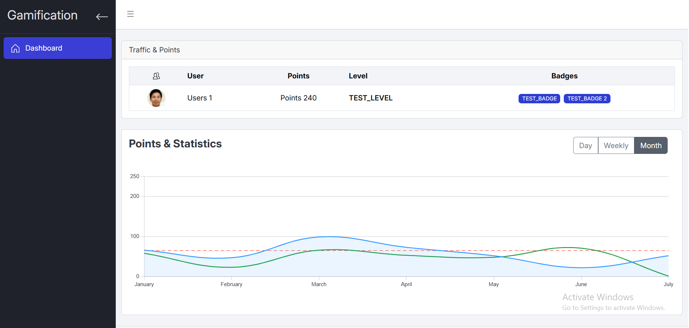

# Project Setup (Gamification Platform)



This project uses Docker Compose to orchestrate multiple services:

## Services & Ports

| Service     | Description                | Port(s)         |
|-------------|----------------------------|-----------------|
| Backend     | Spring Boot API            | 8080            |
| RabbitMQ    | Message broker (management)| 5672, 15672     |
| Frontend    | React app (via Nginx)      | 3000            |
| Swagger     | API documentation (Backend)| 8080/swagger-ui |

## Accessing Services

- **Backend API:**
  - http://localhost:8080
- **Swagger UI:**
  - http://localhost:8080/swagger-ui
- **RabbitMQ Management:**
  - http://localhost:15672 (default user/pass: guest/guest)
- **Frontend:**
  - http://localhost:3000

## Usage

1. Start all services:
   ```sh
   docker-compose up --build
   ```
2. Access the services using the URLs above.

## Notes
- Ensure Docker is installed and running.
- The backend connects to RabbitMQ and PostgreSQL (if configured).
- Swagger UI is available if enabled in the backend Spring Boot configuration.
